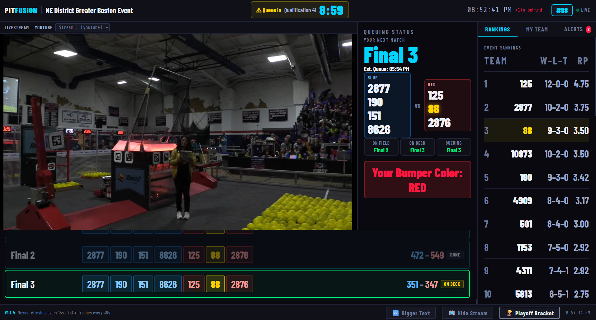
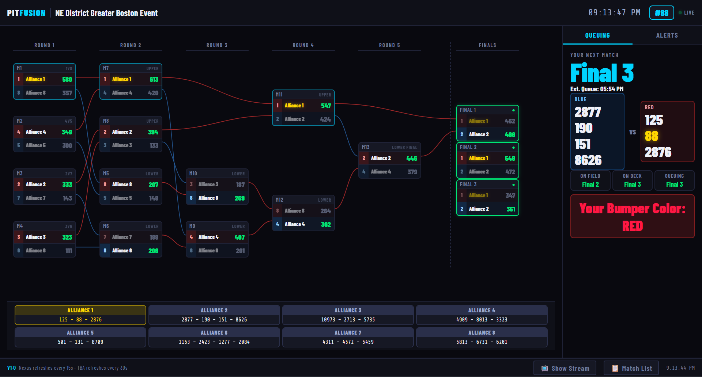
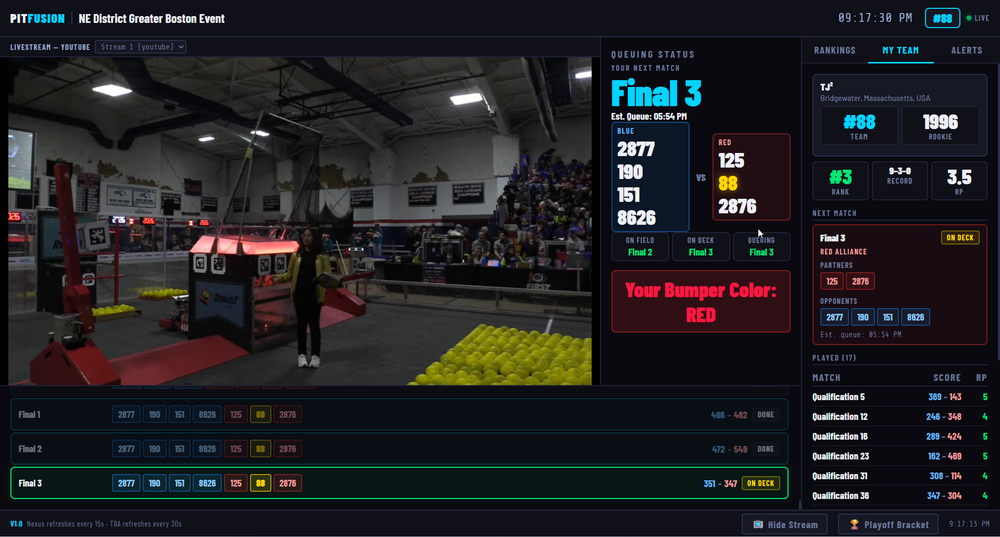
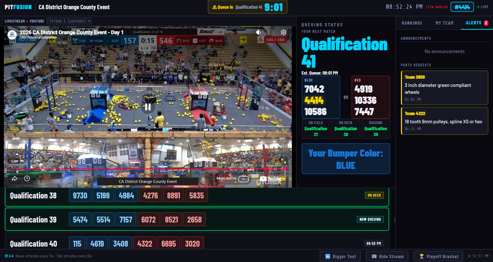

# PitFUSION

**A real-time FRC pit display that fuses Nexus and The Blue Alliance into one screen.**

Created by Mike King — [Team 88 TJ²](https://www.tj2.org/)


---

## Features

- 📺 **Livestream** — auto-detects all available streams for the event with a dropdown selector
- ⏱ **Queuing Status** — live match queue with On Field / On Deck / Queuing indicators
- 🚨 **Queue Countdown** — header countdown timer to your next match queue time, turns red under 5 minutes
- 🎨 **Bumper Color** — prominently displays your alliance bumper color for your next match
- 📋 **Match Schedule** — full qual and playoff schedule with scores, statuses, and auto-scroll to active match
- 🏆 **Playoff Bracket** — full double-elimination bracket view with connector lines and alliance legend
- 📊 **Event Rankings** — live rankings table with your team highlighted, auto-scrolls to your position
- 👕 **My Team** — team info, current ranking, record, RP, next match alliance breakdown, and played match history
- 📢 **Alerts** — Nexus announcements and parts requests
- 🖼 **Logo Support** — automatically loads `logo.png/jpg/jpeg/svg/webp` from the same folder as the HTML file
- 🎨 **4 Themes** — Dark, Light, TJ² (Team 88 tye-dye), and fully customizable Custom theme
- 💾 **Persistent Settings** — team number, event, theme, and font size remembered across reloads
- 🔤 **Font Size Toggle** — footer button switches between readable and extra-large pit display sizes
- ☕ **Break Mode** — shows your next upcoming match from TBA even when Nexus isn't actively queuing
- 🔌 **No Install Required** — single HTML file, no framework, no build step, no dependencies

---

## Quick Start

### 1. Get API Keys

| Key | Where to get it |
|---|---|
| **Nexus API Key** | [frc.nexus/api](https://frc.nexus/api) |
| **The Blue Alliance API Key** | [thebluealliance.com/apidocs](https://www.thebluealliance.com/apidocs) |

### 2. Configure PitFUSION.html

Open `PitFUSION.html` in any text editor. At the **very top of the file** you'll find the configuration block:

```js
// ── API Keys ─────────────────────────────────────────────────
const NEXUS_KEY = 'YOUR_NEXUS_KEY';
const TBA_KEY   = 'YOUR_TBA_KEY';
// ── Version ──────────────────────────────────────────────────
const VERSION   = 'V1.0';
```

Replace `YOUR_NEXUS_KEY` and `YOUR_TBA_KEY` with your actual keys. That's the only code you need to touch.

### 3. Add a Logo (Optional)

Place any of these files in the **same folder** as `PitFUSION.html` and it will appear automatically on the setup screen above the wordmark:

`logo.png` · `logo.jpg` · `logo.jpeg` · `logo.svg` · `logo.webp`

### 4. Serve the File

Browsers block local API calls from `file://` URLs, so you need a simple local web server.

**If you have Python installed:**

```bash
# Navigate to your PitFUSION folder, then run:
python -m http.server 8080
```

Then open your browser to: **http://localhost:8080/PitFUSION.html**

> **Don't have Python?**
> Download from [python.org/downloads](https://www.python.org/downloads/) and run the installer with default settings.
> On Windows you can also type `python` in a Command Prompt and Windows will prompt you to install it via the Microsoft Store.

### 5. Launch

On first load the **setup screen** appears. Enter your team number, select your event from the dropdown (it automatically filters to events your team is registered at this week), choose a theme, and click **Launch PitFUSION**.

Your team number, event code, theme, and font size are saved automatically and restored on the next reload.

---

## Themes

| Theme | Description |
|---|---|
| **Dark** | Default — deep navy with cyan accents |
| **Light** | Clean white/grey with navy accents |
| **TJ²** | Team 88's real tye-dye photo background with frosted glass panels and team colors |
| **Custom** | Fully configurable — edit colors and optional background image directly in the HTML |

### Custom Theme

Edit the `[data-theme="custom"]` block near the top of the `<style>` section (around line 100).

**Key variables:**

| Variable | Default | What it does |
|---|---|---|
| `--bg` | `#0d0d0d` | Main background color |
| `--surface` | `#141414` | Card and panel background |
| `--surface2` | `#1c1c1c` | Secondary panel background |
| `--accent` | `#ff9900` | Primary highlight color |
| `--text` | `#f0f0f0` | Primary text color |
| `--text-dim` | `#707070` | Dimmed/secondary text |
| `--custom-bg-image` | `none` | Background image, e.g. `url('myimage.jpg')` |
| `--custom-bg-washout` | `0.0` | Overlay opacity: `0.0` (none) → `1.0` (solid) |
| `--custom-bg-washout-color` | `0,0,0` | Overlay RGB — use `255,255,255` for light themes |

See the full [Custom Theme Guide](docs/PitFusion_Custom_Theme.md) for all variables and examples.

---

## Files

| File | Purpose |
|---|---|
| `PitFUSION.html` | The entire application — this is all you need |
| `logo.png` (optional) | Team logo shown on setup screen |
| `FRC88Background.png` (optional) | Required only for the TJ² theme |
| `[your-bg-image]` (optional) | Background image for the Custom theme |

All files should be in the same folder.

---

## Screenshots

| | |
|---|---|
| [](docs/MainScreen1.png) | [](docs/BracketView1.png) |
| Main display | Playoff bracket |
| [](docs/TeamView1.png) | [](docs/AlertsView1.png) |
| My Team tab | Alerts tab |

---

## Acknowledgements

Built on the shoulders of these excellent tools and communities:

- [Nexus](https://frc.nexus/) — real-time FRC event queuing data
- [The Blue Alliance](https://thebluealliance.com/) — match schedules, rankings, and results
- [Pulse - Pit Display](https://pulsefrc.app/) — original inspiration
- [Team 88 TJ²](https://www.tj2.org/) — home team

---

## License

MIT — free to use, modify, and share. Attribution appreciated.
